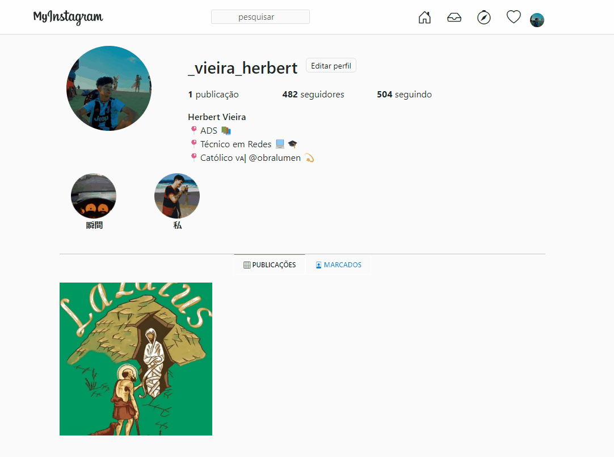

<h1 align="center"> Meu instagram </h1>

Copia da pagina do meu perfil do instagram  

  <a href="#-tecnologias">Tecnologias</a>&nbsp;&nbsp;&nbsp;|&nbsp;&nbsp;&nbsp;
  <a href="#-projeto">Projeto</a>&nbsp;&nbsp;&nbsp;&nbsp;&nbsp;&nbsp;
  

 

  

  
  

## 🚀 Tecnologias

Esse projeto foi desenvolvido com as seguintes tecnologias:

- HTML e CSS
- Bootstrap
- Git e Github

## 💻 Projeto

O meu perfil do instagram é uma copia da minha página do meu instagram, ao clicar no icone "myinstagram" o usuário é redirecionado ao meu perfil real do instagram

- [Acesse o projeto finalizado, online](https://CarlosHerbertDev.github.io/myinstagram)
